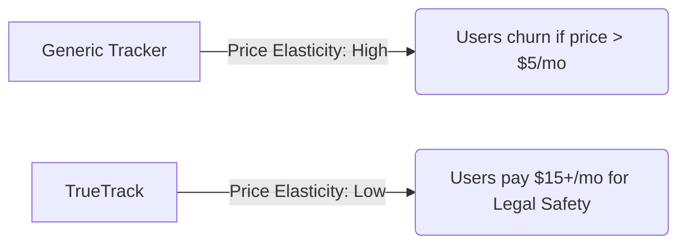
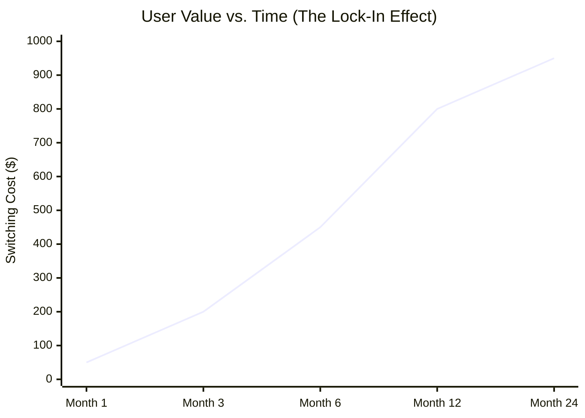
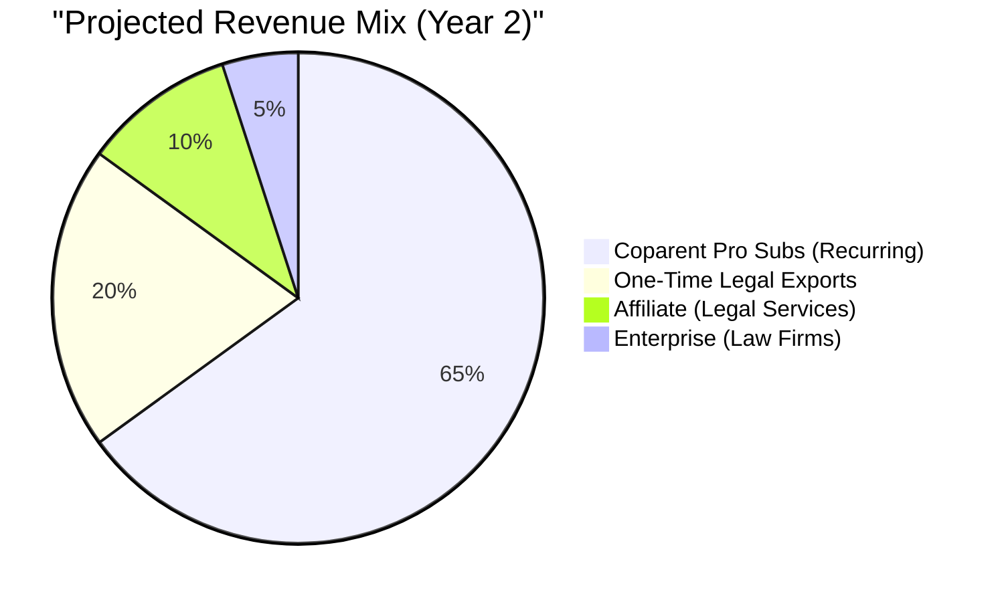

# 📈 Strategic Product Compass: "The Financial Sovereignty Engine"

> **Class:** Advanced Marketing Strategy / Digital Economics
> **Case Study:** TrueTrack
> **Objective:** Maximizing LTV in Niche "High-Pain" Vertical

This document provides a deep-dive analysis of the TrueTrack product ecosystem, mapping technical features to specific economic outcomes. It includes projected data models and monetization graphs suitable for investor presentation.

---

## � I. Market Sizing & The "Pain Premium"

TrueTrack operates in a specialized vertical: **High-Stakes Personal Finance**. Unlike generic budgeting apps (Mint, Rocket Money), TrueTrack targets users who have *external pressure* to track finances (Legal Courts, Custody Agreements, Debt Recovery).

*   **TAM (Total Addressable Market):** ~15% of Households (Single Parents + Co-parents).
*   **SAM (Serviceable Addressable Market):** Tech-literate single fathers in urban centers.
*   **SOM (Serviceable Obtainable Market):** ~500k active users (Year 3 target).

### The Inelastic Demand Curve
Because specific features (Evidence Score, Legal Export) solve a "Hair-on-Fire" problem (losing custody, facing legal fines), price sensitivity is significantly lower than average.



---

## 🏗️ II. Feature-to-Value Deep Dive

### 1. The "Trust" Engine (Free Tier)
**Core Mechanic:** Gemini AI Scanning & Local-First Storage.

| Feature | User Benefit | Economic Value (Marketing) |
| :--- | :--- | :--- |
| **Smart Scan** | "Magic" data entry. | **CAC Reduction**: Viral "Wow factor" drives word-of-mouth. |
| **Evidence Score** | Gamified proof of provision. | **Activation**: Users chase a "100" score, building daily habits. |
| **Mock Mode** | No cleanup required. | **Trust Barrier**: Lowers entry friction to near zero. |

### 2. The "Sovereignty" Engine (Coparent Pro - €12.99/mo)
**Core Mechanic:** Physiological & Psychological Safety.

| Feature | User Benefit | Economic Value (Marketing) |
| :--- | :--- | :--- |
| **Ambient Mode** | Mood-based financial health. | **Retention**: Transforms "Reviewing Budget" from a chore to a visual experience. |
| **Habit Stacking** | Tracking drinking/junk food. | **ARPU Expansion**: Justifies premium pricing by replacing a 2nd app (Habit Tracker). |
| **Parental Controls** | Hides 18+ items from logs. | **Churn Prevention**: Prevents conflict with ex-partners, keeping the user "safe". |

---

## 📊 III. Monetization Strategy & Growth Charts

The following models demonstrate how we transition users from "Free" to "Vital" status.

### A. The "Lock-In" Curve (Retention Strategy)
Data value increases over time. A user with 6 months of legal logs cannot leave without incurring massive "Switching Costs."



### B. Revenue Projection (Free-to-Paid Conversion)
We anticipate a lower conversion rate initially, followed by a spike as legal pressures (court dates) approach for individual users.



### C. Feature Adoption Funnel
Marketing should target features in this specific order to maximize conversion.

```mermaid
graph TD
    A[Download App] -->|Hook: Smart Scan| B(Active Free User)
    B -->|Trigger: Court Date or Conflict| C{Need Legal Proof?}
    C -->|Yes| D[Upgrade to Pro (Export Data)]
    C -->|No| E{Want Better Health?}
    E -->|Yes| F[Upgrade to Pro (Habits/Ambient)]
    D --> G(LTV: $300+)
    F --> G
```

---

## 🔮 IV. Future Blue Ocean Opportunities

### 1. The "Legal API" (B2B)
Instead of selling to users, we sell the dashboard to **Family Law Firms**.
*   **Concept:** Lawyers pay for a "Client Portal" where they can see their client's spending in real-time.
*   **Gains:** Extremely high LTV ($500+/mo per firm).

### 2. Dynamic Insurance
Using the "Evidence Score" to underwrite micro-loans or legal insurance.
*   **Concept:** "You have a 98% Provision Score. You qualify for discounted Legal Defense Insurance."

---

## � Student Pitch Script (Key Takeaways)

1.  **Don't sell "Budgeting":** Sell "Evidence" and "Reputation".
2.  **Highlight Inelasticity:** Investors love products that people *need* (Legal defense) vs products people *want* (Budgeting).
3.  **The "Trojan Horse":** We enter the user's life as a helpful scanner (Free), but we stay as their legal defense system (Pro).
